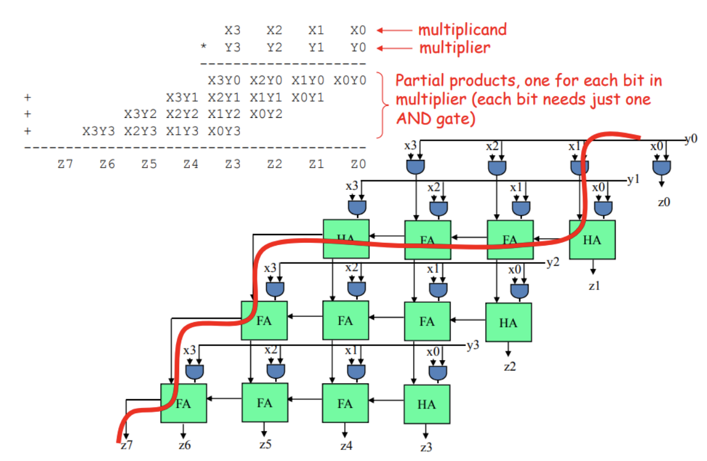

# Design of a Combination Multiplier
**California State University, Northridge**  
**Department of Electrical and Computer Engineering**  

## Objective

After completing this assignment, students will be able to:
- Create a Vivado project sourcing HDL model(s) and targeting a specific FPGA device located on the development board
- Instantiate multiple components inside a top level design
- Simulate the design using the Vivado simulator
- Synthesize and implement the design 

## Requirements

- Git >= 2.33
- GitHub account
- Link to GitHub classroom assignment
- Vivado 2019.1

## References
- https://git-scm.com/
- https://guides.github.com/
- https://www.xilinx.com/support/documentation/sw_manuals/xilinx2019_1/ug904-vivado-implementation.pdf

## Introduction

The following diagram shows a logic circuit that accepts two 4 bit numbers (X3 X2 X1 X0 and
Y3 Y2 Y1 Y0) and multiplies these two inputs to produce an 8 bit unsigned number
(Z7 Z6 Z5 Z4 Z3 Z2 Z1 Z0) as a result. 

Part I: The circuit is composed of and gates, full adders and half adders. 

## Tasks
:point_right: **Task 1**: (10 points) 
Write VHDL dataflow model for full adder and half adder.

:point_right: **Task 2**: (20 points) 
Write VHDL testbenches for half adder and full adder to prove their correct
functionality.

:point_right: **Task 3**: (10 points) 
Implement a VHDL structural model of the circuit shown above. Your structural model
should use two components you designed in part 1: full adder and half adder. 

:point_right: **Task 4**: (20 points) 
Write a VHDL testbench for your complete design and simulate your design to show it
successfully multiplies two unsigned numbers. 

Part II: The given block diagram can be modified to implement a signed 4x4 multiplier
according to the diagram below. 

As it can be seen, each partial product can be sign extended and the final result will be the sum
of all these partial products.

:point_right: **Task 5**: (20 points) 
Modify the present VHDL design to implement a signed 4x4 multiplication. 
Your model should use two's components with full adder and half adder you designed in part 1.

:point_right: **Task 6**: (20 points) 
Write a VHDL testbench for your complete design and simulate your design to show it
successfully multiplies two signed numbers. 

Note: Your submitted assignment must be synthesizable to get the full point.
